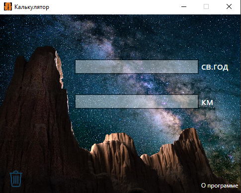

# Модель: Программа для конвертирование световой год в килиметры
---

__Разработчик__: Gantsevich Alexey  
__Канал__: Chessplayer - IT Specialist  
__ПО__: Microsoft Visual Studio 

---

### О проекте:  
Программа "_Light years to km_" была сделана при помощи программы Visual Studio. Программа распространяется по лицензии __GPLv3__, она разрешает людям использовать и даже распространять модель без требования платить за это кому бы то ни было и использовать в коммерческих проектах. 

Вы можете его скачать и измениять его. Ппрограмма, созданная на основе программы «_Light years to km_», должна распространяться также на условиях GPL, она не может быть переведена на коммерческую лицензию модификаторами и прочими «третьими лицами». 

В проекте есть папка Applications где находится готовые программы, вы можете их установить и использовать:
- установщик программы
- портативная программа

### Зачем нужен:  
Программа для конвертирование световой год в килиметры.

### Котакты: 
* Основной канал: [Chessplayer - IT Specialist](https://www.youtube.com/@chessplayeritspecialist)  
* Канал разработчика: [Alexey Gantsevich](https://www.youtube.com/channel/UCt7oE2_eelKlB88rXJ00jXg)
